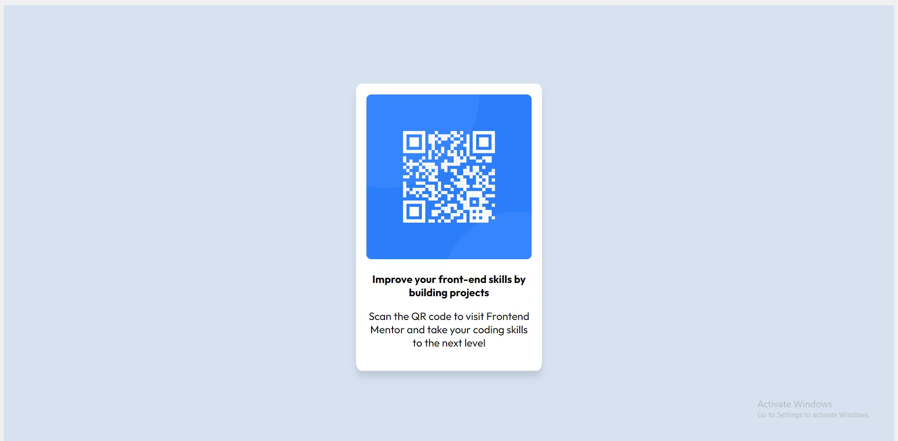

# Frontend Mentor - QR code component solution

This is a solution to the [QR code component challenge on Frontend Mentor](https://www.frontendmentor.io/challenges/qr-code-component-iux_sIO_H). Frontend Mentor challenges help you improve your coding skills by building real projects. 

## Table of contents

- [Overview](#overview)
  - [Screenshot](#screenshot)
  - [Links](#links)
  - [Built with](#built-with)
  - [What I learned](#what-i-learned)
- [Author](#author)

## Overview

### Screenshot



### Links

- Solution URL: [Solution Using HTML and CSS](https://github.com/mansimar-s/fem_qrCode)
- Live Site URL: [Visit Solution](https://mansimar-s.github.io/fem_qrCode/)


### Built with

- Semantic HTML5 markup
- CSS custom properties
- Flexbox
  
### What I learned

#### Using Container for Images

```html
<div class="img-container">
  
</div>
```

## Author

- Website - [Mansimar Singh](https://www.direct.me/mansimarsingh)
- Frontend Mentor - [@mansimar-s](https://www.frontendmentor.io/profile/mansimar-s)
- Instagram - [@_mansimarsingh](https://www.instagram.com/_mansimarsingh/)


